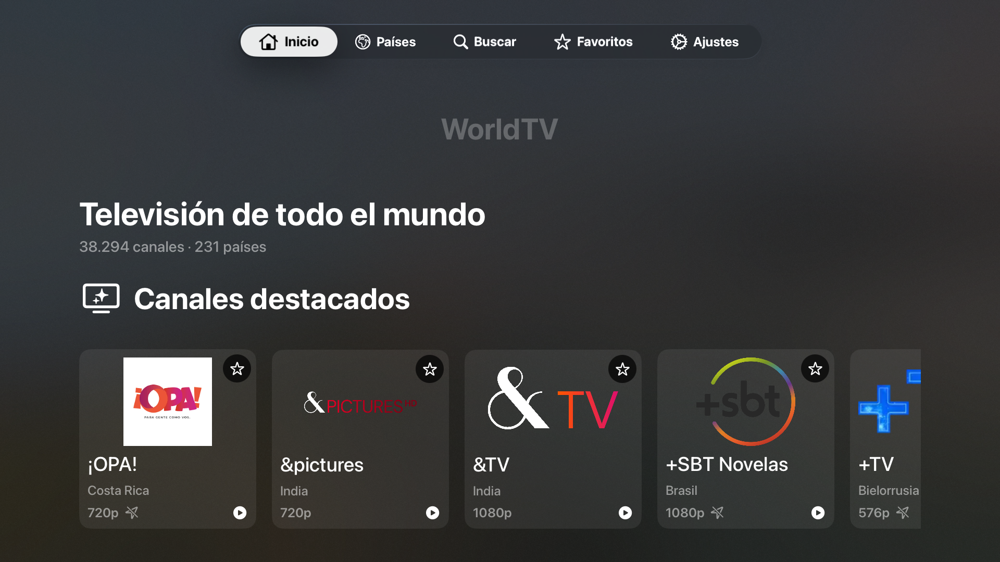

# WorldTV

[](https://github.com/HerniRG/WorldTV/actions/workflows/ci.yml)
[](LICENSE)
[](https://www.swift.org)

WorldTV is a native SwiftUI application for discovering and playing free, publicly accessible television streams from around the world. It uses the structured datasets published by [iptv-org](https://github.com/iptv-org/iptv) and shares its domain and data layers across Apple platforms.

WorldTV does not host, mirror, or retransmit channels.

## Platforms

| Platform | Navigation and presentation |
| --- | --- |
| iPhone | Bottom tabs, adaptive channel grids, native full-screen player |
| iPad | `NavigationSplitView`, sidebar, adaptive grids |
| Apple TV | Top-level tabs, large cards, explicit focus treatment, native player |
| Mac | Resizable sidebar, toolbar actions, integrated player |

The current deployment target is 26.5 for iOS/iPadOS, macOS, and tvOS.

## Features

- Home with featured channels, popular countries, categories, favorites, and recent channels
- Country browser with localized region names and channel counts
- Local channel search across names, countries, categories, and stream titles
- Country, category, quality, availability, favorite, and geoblocking filters
- Local favorites and recently watched history
- `AVPlayer` playback with ordered source fallback and bounded timeouts
- Preferred playback quality, autoplay, catalog refresh, and local data controls
- English and Spanish localization
- VoiceOver labels, Reduce Motion support, Dynamic Type, and platform-specific focus or hover
- Persistent 24-hour catalog cache with stale fallback
- Swift 6 strict concurrency and offline unit tests

## Screenshots



The visual identity, cross-platform App Icon, layered Apple TV icon, and Top Shelf artwork are now part of the asset catalog. The repository also contains the remaining [release screenshot checklist](docs/screenshots/README.md).

## Requirements

- macOS 26.5 or newer
- Xcode 26.6 or newer
- No third-party dependencies
- An internet connection for the initial catalog load and live playback

## Run locally

1. Clone the repository:

   ```sh
   git clone https://github.com/HerniRG/WorldTV.git
   cd WorldTV
   ```

2. Open `WorldTV.xcodeproj`.
3. Select the `WorldTV` scheme.
4. Choose an iPhone, iPad, Apple TV, or Mac destination.
5. Build and run.

No API keys, accounts, signing credentials, analytics configuration, or private services are required. A personal development team may be needed when installing on physical devices.

## Tests

Unit tests use Swift Testing and small local fixtures. They never contact live endpoints.

```sh
xcodebuild \
  -project WorldTV.xcodeproj \
  -scheme WorldTV \
  -destination 'platform=macOS' \
  -only-testing:WorldTVTests \
  test
```

The cross-platform UI target contains a launch smoke test. The GitHub workflow runs unsigned builds for every supported platform and the complete unit-test target.

## Architecture

WorldTV follows pragmatic Clean Architecture:

```text
SwiftUI feature → use case → repository protocol → data implementation
```

Dependencies are constructed explicitly in `AppContainer`. Domain types do not depend on SwiftUI, AVKit, or networking implementations. Repository actors own shared mutable state, while UI ViewModels use Observation and are isolated to `MainActor`.

See [ARCHITECTURE.md](ARCHITECTURE.md) for catalog indexing, concurrency, playback, persistence, and platform decisions.

## Data source and privacy

Catalog metadata comes from public [iptv-org API datasets](docs/DATA_SOURCES.md). Availability is controlled by third parties and individual links may stop working, be restricted by location, or have rights that vary by jurisdiction.

WorldTV:

- accepts HTTPS catalog resources and streams by default;
- excludes NSFW, blocklisted, closed, orphaned, and invalid entries;
- stores preferences, favorites, history, and catalog cache only on the device;
- includes no accounts, analytics, advertisements, or tracking.

## Legal notice and channel removal

Read [DISCLAIMER.md](DISCLAIMER.md) before distributing or using the app. Channel names, logos, streams, and trademarks belong to their respective owners and are not licensed under this repository's MIT license.

Rights holders can use the documented [channel-removal process](DISCLAIMER.md#channel-removal-requests). Security reports must follow [SECURITY.md](SECURITY.md), not the public removal form.

## Project status

The core product is feature-complete for its first open-source milestone. Distribution assets are in place and the app has been installed and launched on a physical Apple TV. Distribution still requires the remaining release screenshots, the full physical-device test matrix, and store-specific privacy or legal metadata.

See [CHANGELOG.md](CHANGELOG.md) and the [roadmap](docs/ROADMAP.md) for release status and planned work.

## Contributing

Contributions are welcome. Read [CONTRIBUTING.md](CONTRIBUTING.md) before opening an issue or pull request.

## License

WorldTV source code is available under the [MIT License](LICENSE). The license does not grant rights to third-party channel metadata, logos, trademarks, or streams.
